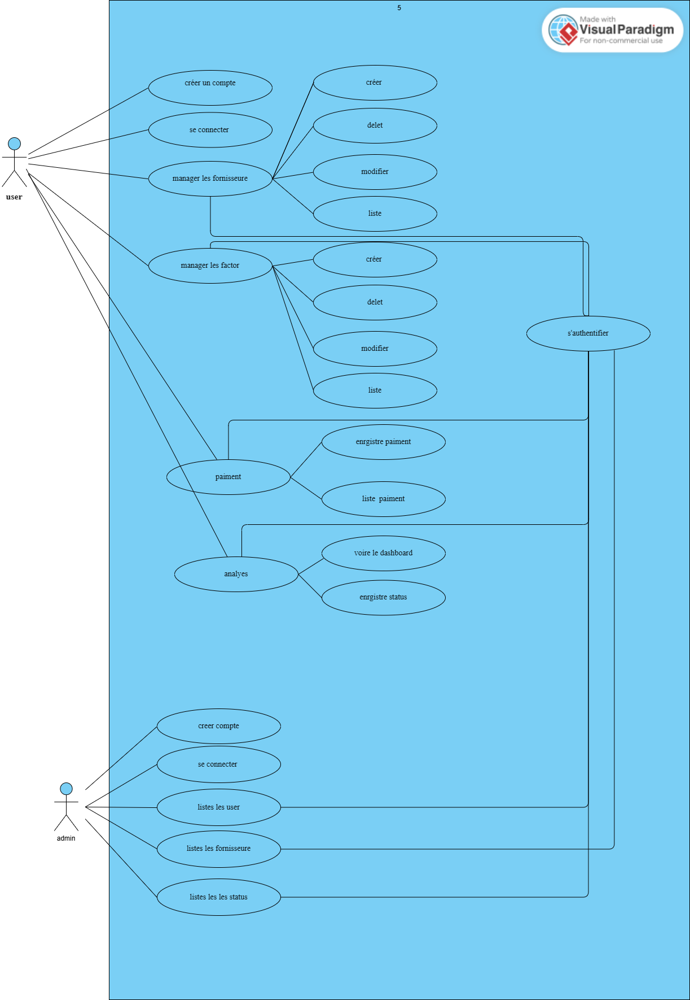
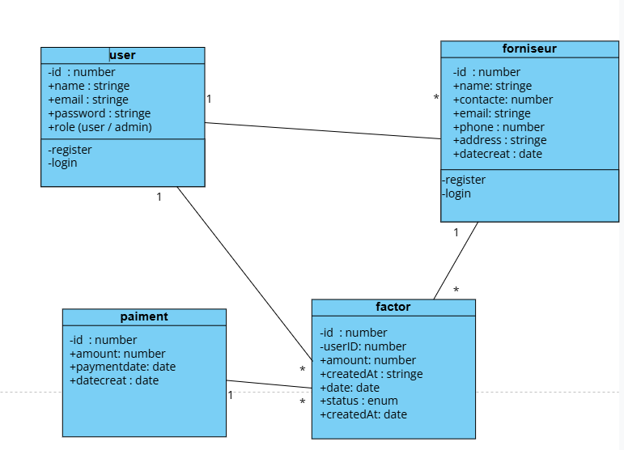
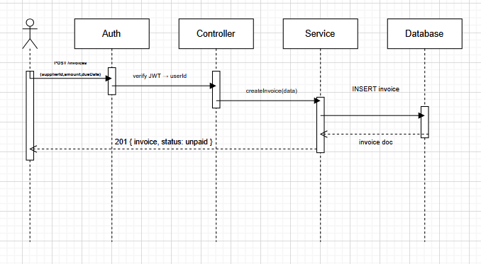

Description

Ce projet est une API backend permettant aux entreprises et freelances de gérer efficacement leurs fournisseurs, factures et paiements.

Elle offre :

Gestion des fournisseurs (CRUD)
Gestion des factures avec suivi des statuts
Gestion des paiements partiels et complets
Statistiques des dépenses
Authentification sécurisée avec JWT

 Technologies utilisées

Node.js / Express (ou Laravel selon ton choix)
JWT Authentication
MySQL / MongoDB
PlantUML (pour les diagrammes)

 UML Diagrams
##  Use Case Diagram

Voici le diagramme de cas d'utilisation du système :

---

##  Class Diagram

Voici le diagramme de classes :

##  Sueqence Diagram

Voici le diagramme de Sueqence :

